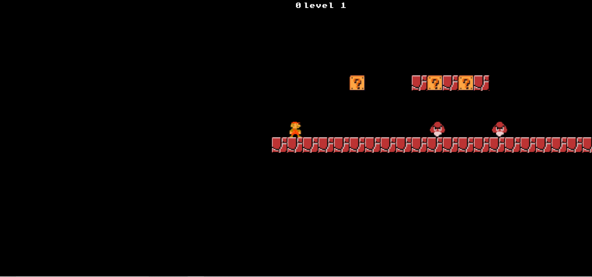
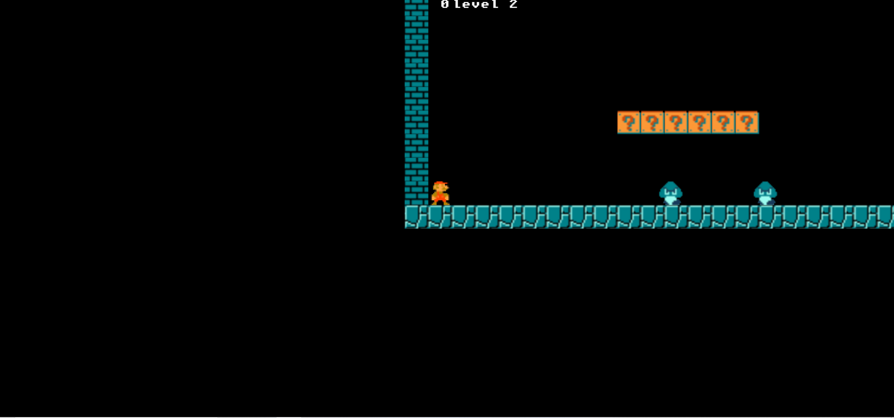

# mario

This is a Mario game that I made using Kaboom.JS. This is my second time using this technology and I'm really starting to enjoy it.

# Environment Setup

1. Clone my repo at https://github.com/davidmstanleyjr/mario.

2. CD into it and select "run in browser".

# Technologies Used

1. HTML
2. CSS
3. JavaScript
4. Kaboom.js

# Issues

This project wasn't that tough because I got the hang of Kaboom.js while doing the Zelda game. Writing the logic to make Mario increase in size was hard at first but then I realized that Kaboom has an innate method called "biggify" to make things big. I used that everything fell into place.

# Screenshots

